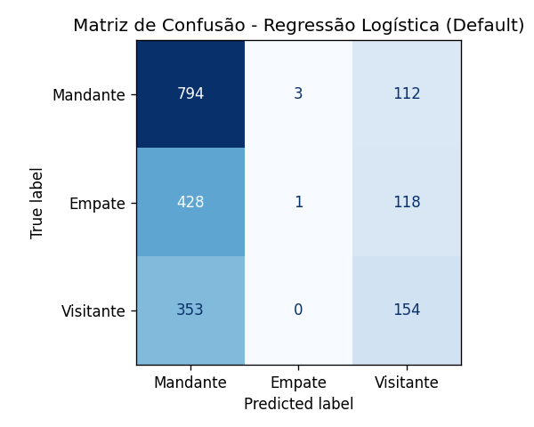

# Previsão do Resultado de Partidas de Futebol via Mineração de Dados

> **Rascunho do artigo** (Trabalho Final — Mineração de Dados Aplicada).
> Segue a estrutura sugerida no enunciado (template SBC). Os blocos marcados com
> `> TODO` precisam ser completados/escritos no artigo final.
> Processo conduzido segundo o **KDD** (Knowledge Discovery in Databases).

> TODO: autores (grupo de 2), instituição, e-mails (template SBC).

---

## 1. Introdução

**Contextualização.** Prever o resultado de partidas de futebol é um problema
clássico de análise esportiva, com aplicações em jornalismo, clubes e mercado de
apostas. O resultado, porém, tem forte componente de aleatoriedade, o que o torna
um bom estudo de caso para mineração de dados.

**Motivação.** Estimar, *antes* do jogo, o resultado mais provável a partir de
informações objetivas (força das equipes, mando de campo, competição).

**Objetivo de negócio.** Auxiliar analistas/apostadores a estimar o resultado
mais provável de uma partida antes de ela acontecer.

**Objetivo de mineração.** Treinar um modelo de **classificação** que, a partir de
atributos conhecidos antes do jogo, prevê a classe do resultado:
*vitória do mandante (0)*, *empate (1)* ou *vitória do visitante (2)*.

**Organização.** A Seção 2 traz o referencial teórico; a Seção 3 detalha a
metodologia (dados, preparação e modelagem); a Seção 4 apresenta resultados e
discussão; a Seção 5 conclui e aponta trabalhos futuros.

---

## 2. Referencial Teórico e Trabalhos Correlatos

- **KDD**: processo de descoberta de conhecimento em bases de dados (seleção,
  pré-processamento, transformação, mineração e interpretação).
- **Classificação**: tarefa de prever uma categoria. Algoritmos usados: Regressão
  Logística, Random Forest, Naïve Bayes e KNN.
- **Sistema de rating Elo**: medida contínua de força de uma equipe, usada aqui
  como principal atributo preditivo.

> TODO: citar trabalhos correlatos (ex.: modelo de Poisson de Maher; Dixon-Coles
> para previsão de placares) e referências formais no padrão SBC.

---

## 3. Metodologia

### 3.1 Compreensão dos Dados

- **Fonte.** Dados extraídos do sistema do **[futmetricas.com.br](https://futmetricas.com.br)**.
- **Volume.** 6.063 partidas e 27 atributos no arquivo bruto (`matches.csv`).
- **Tipos de variáveis.** Numéricas (placar, posse, chutes, elo...), categóricas
  (times, liga, árbitro) e temporais (data, temporada).
- **Concentração temporal.** A base é majoritariamente de 2022 a 2026 (2010 e
  2018 aparecem com 1–2 jogos, descartáveis como ruído).

**Análise exploratória — problemas identificados:**

| Achado | Decisão |
|---|---|
| Dataset auxiliar `teams.csv` com +92% de valores ausentes | Descartado |
| Atributos pós-jogo (posse, chutes, cartões, escanteios, faltas) | Removidos (vazamento) |
| Identificadores e nomes redundantes (`match_id`, `*_team_name`, `league_name`) | Removidos |
| Identidade dos times redundante com o elo | Substituída pelo elo |
| **Desbalanceamento de classes**: mandante vence ~46% das vezes | Considerado na avaliação |

### 3.2 Preparação dos Dados

1. **Limpeza** — remoção de partidas sem placar (alvo).
2. **Criação do alvo** — `result` (0/1/2) derivado da comparação dos placares; os
   placares são então descartados (seriam vazamento).
3. **Valores ausentes** — preenchimento neutro em colunas não-alvo
   (`referee` → "Unknown", `round_number` → 0).
4. **Codificação de categóricas** (por cardinalidade):
   - times: **descartados** (redundantes com o elo);
   - `referee` (alta cardinalidade, ~619 valores): **frequency encoding** (1 coluna);
   - `league_id` (7 ligas): **one-hot encoding**.
5. **Padronização** — `StandardScaler` (média 0, desvio 1) nos modelos sensíveis a
   escala, para o elo (~1500) não dominar as demais features.
6. **Divisão treino/teste** — **por temporada** (não aleatória): treino até 2024,
   teste em 2025–2026. Evita vazamento temporal (treinar no passado, testar no
   futuro). Resultado: 4.061 jogos de treino e 1.963 de teste, com 13 atributos.

> Resultado da preparação: de ~1.550 colunas (com one-hot em tudo) para **13**,
> sem perda relevante de performance — confirmando a redundância dos times.

### 3.3 Modelagem

- **Ferramentas/bibliotecas.** Python, pandas, scikit-learn, matplotlib.
- **Algoritmos** (classificação) e justificativa:
  - **Regressão Logística** — baseline linear; estima a probabilidade de cada classe.
  - **Random Forest** — comitê de árvores, robusto a ruído.
  - **Naïve Bayes** — probabilístico, rápido (assume independência das features).
  - **KNN** — classifica pelos jogos mais parecidos.
  - **DummyClassifier** (classe mais comum) — baseline ingênuo / régua mínima.
- **Estratégia de validação.** Avaliação em conjunto de teste temporal separado
  (out-of-time). Métrica principal: **acurácia**; análise complementar com
  **matriz de confusão** e **precision/recall/F1** por classe.

> TODO: incluir ajuste de hiperparâmetros (grid/random search) e validação cruzada
> temporal como aprofundamento.

---

## 4. Resultados e Discussão

**Acurácia no conjunto de teste:**

| Modelo | Acurácia |
|---|---|
| **Regressão Logística** | **0.483** |
| Random Forest | 0.476 |
| Baseline (classe mais comum) | 0.463 |
| KNN | 0.452 |
| Naïve Bayes | 0.418 |

Apenas **Regressão Logística** e **Random Forest** superam o baseline ingênuo
(0.463). KNN e Naïve Bayes ficam abaixo — coerente: o Naïve Bayes é penalizado
por assumir independência entre features correlacionadas (elos de mandante e
visitante), e o KNN sofre com a aleatoriedade ("jogos parecidos" nem sempre têm o
mesmo desfecho).

**Matriz de confusão (Regressão Logística):**



| Real ↓ / Previsto → | Mandante | Empate | Visitante |
|---|---|---|---|
| **Mandante** | 794 | 3 | 112 |
| **Empate** | 428 | 1 | 118 |
| **Visitante** | 353 | 0 | 154 |

**Análise crítica.** A acurácia de ~48% esconde o achado mais importante: o modelo
**quase nunca prevê empate** (recall do empate ≈ 0.2%, apenas 1 de 547 acertos).
Ele concentra os palpites em "mandante vence" (recall 87%). Isso reflete o
**desbalanceamento** e a natureza notoriamente imprevisível do empate no futebol.
A acurácia, sozinha, mascararia esse comportamento — daí a importância da matriz de
confusão.

**Limitações.** Conjunto pequeno de atributos pré-jogo (essencialmente o elo);
ausência de variáveis como escalações, lesões, sequência de resultados e mando
real (viagem/altitude). Placar exato havia se mostrado ainda mais difícil, o que
motivou a reformulação do problema como classificação de resultado.

---

## 5. Conclusões e Trabalhos Futuros

**Conclusões.** Foi possível conduzir o processo completo de KDD e construir
modelos que superam (modestamente) o baseline. O sinal preditivo é dominado por um
componente linear simples (elo + mando de campo), e modelos mais complexos não
trouxeram ganho — indicando que o gargalo está nos **atributos**, não no algoritmo.

**Atendimento aos objetivos.** O objetivo de mineração (classificar o resultado)
foi atingido; o de negócio é parcialmente atendido, dado o teto de previsibilidade
do futebol.

**Lições aprendidas.** Importância de evitar vazamento de dados; valor dos
baselines como régua; e que acurácia isolada pode enganar em classes
desbalanceadas.

**Trabalhos futuros.** Engenharia de novos atributos (diferença de elo, forma
recente, distância de viagem); tratamento do desbalanceamento (reamostragem,
pesos por classe); ajuste de hiperparâmetros; e validação cruzada temporal.

---

## Como rodar (reprodutibilidade)

A partir da raiz do projeto (`ml/`):

```bash
pip install -r requirements.txt
python -m src.main
```

O script trata os dados (`datasets/raw/matches.csv`), salva a versão processada em
`datasets/processed/`, treina/avalia os modelos e gera a matriz de confusão em
`reports/`.

### Estrutura do projeto

```
ml/
├── datasets/raw/            # dados originais
├── datasets/processed/      # saída tratada (ignorada no git)
├── reports/                 # gráficos (matriz de confusão)
├── src/
│   ├── data/                # preparação dos dados
│   │   ├── pipeline.py      # limpeza, criação do alvo, encoding, X/y
│   │   └── split.py         # divisão treino/teste por temporada
│   ├── models/              # algoritmos de classificação
│   │   ├── baseline.py      # DummyClassifier (régua)
│   │   ├── logistic.py      # Regressão Logística
│   │   ├── forest.py        # Random Forest
│   │   ├── naive_bayes.py   # Naïve Bayes
│   │   └── knn.py           # KNN
│   ├── evaluation.py        # matriz de confusão + relatório por classe
│   └── main.py              # orquestra todo o fluxo
└── requirements.txt
```
